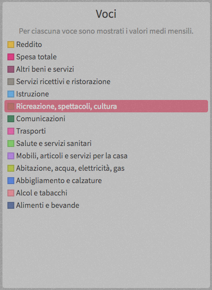
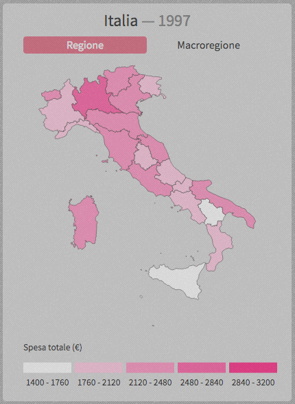
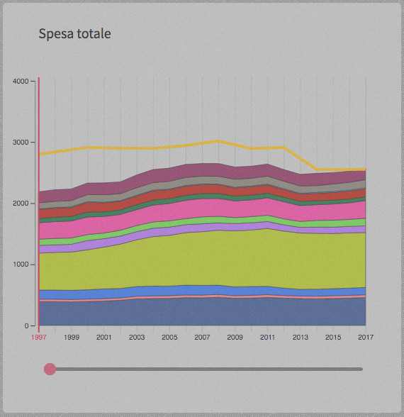
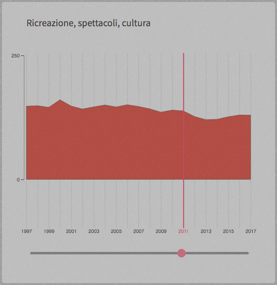

# 🇮🇹 D3IE-Italy 
## Guida rapida all'utilizzo

### Introduzione

D3IE-Italy è un progetto realizzato da Matteo Loporchio, studente di Informatica, nell'ambito del corso di Scientific and Large Data Visualization presso l'Università di Pisa. Il lavoro è stato supervisionato dai docenti Paolo Cignoni e Daniela Giorgi dell'ISTI-CNR di Pisa.

Si tratta di una mappa interattiva che ha lo scopo di illustrare l'evoluzione dei redditi e consumi delle famiglie italiane dal 1997 al 2017. Tutti i valori presi in considerazione sono calcolati come media mensile per ciascuna famiglia.

I dati sui redditi sono stati elaborati a partire dall'<strong>Indagine sui bilanci delle famiglie italiane</strong> condotta dalla Banca d'Italia. Le informazioni sui consumi provengono invece dall'<strong>Indagine sulle spese delle famiglie</strong> effettuata dall'Istat a partire dal 2014. Per gli anni precedenti, sono stati utilizzati i dati dell'analoga <strong>Indagine sui consumi delle famiglie</strong> ad opera dello stesso Istat.

Le spese delle famiglie sono suddivise in 12 categorie, secondo
la classificazione Istat. L'utente può selezionare singolarmente
ciascuna di esse per conoscerne l'andamento oppure può visualizzare il loro totale, confrontandone l'evoluzione con la variazione del reddito. Oltre alle voci di spesa, l'utente può concentrarsi anche su un determinato anno o su una ben precisa regione o macroregione del paese.

La schermata principale di D3IE-Italy si articola in tre riquadri principali:

1. La mappa vera e propria, che raffigura l'Italia.
2. Il grafico del reddito e delle spese.
3. Il riquadro di selezione delle voci.

Presentiamo di seguito il loro funzionamento.

### Selezione voci

Il riquadro più a destra consente all'utente di selezionare la voce di spesa da visualizzare. Per facilitare la distinzione, a ciascuna voce è associato un colore. Cambiando categoria, mappa e grafico verranno opportunamente modificati per presentarne - rispettivamente - l'andamento nello spazio e nel tempo.

### Mappa

Il riquadro raffigura la penisola italiana colorata secondo la voce di spesa corrente e relativamente all'anno selezionato. La legenda sotto il grafico mostra le diverse fasce per quella categoria.
Portando il mouse sopra una singola regione è possibile visualizzare l'ammontare in Euro della voce selezionata. Facendo invece clic su di essa l'attenzione si sposta sui dati regionali e il grafico verrà modificato per riflettere tali spese e consumi.

È inoltre possibile cambiare la modalità di visualizzazione passando dalle singole regioni alle macroregioni Istat, facendo clic sull'apposito pulsante sotto il titolo. Anche in questo caso, i dati del grafico verranno opportunamente aggiornati per mostrare i consumi aggregati.

### Grafico

Il grafico ha lo scopo di mostrare l'andamento delle spese e del reddito nel corso del tempo. Le voci di spesa sono identificate dal proprio colore e sono raffigurate come bande "impilate" l'una sopra all'altra, come avviene in un classico grafico <em>stacked area</em>. Maggiore è l'ampiezza di ciascuna banda, maggiore è l'ammontare della spesa. L'ampiezza è naturalmente variabile nel corso degli anni e ciascuna banda può contrarsi ed espandersi in corrispondenza di un aumento o una diminuzione. 

Sull'asse delle ordinate è riportata una scala utile per confrontare reddito e spesa complessiva: quest'ultima può essere dedotta si considera la pila formata da tutte le categorie, poiché il livello raggiunto dalla banda più in alto è esattamente uguale alla somma di tutte le voci. La linea gialla invece rappresenta l'andamento del reddito come in un normale grafico cartesiano.

Passando con il mouse sopra a ciascuna banda, questa viene evidenziata per favorirne la visualizzazione. Se si fa clic sopra di essa, il grafico viene modificato e viene visualizzato nel dettaglio l'andamento della categoria, come si vede nella figura sulla destra. In questo caso, la variazione della spesa è deducibile dal profilo del grafico, come in un comune diagramma cartesiano.

Con il trascinamento dello slider al di sotto del grafico è possibile cambiare l'anno di riferimento. Questo cambiamento si riflette sia sul grafico, dove una barra verticale rossa mostra in quale punto ci si trova, sia sulla mappa, dove la colorazione 
viene aggiornata con le nuove informazioni temporali e sulla base della voce attualmente selezionata.

